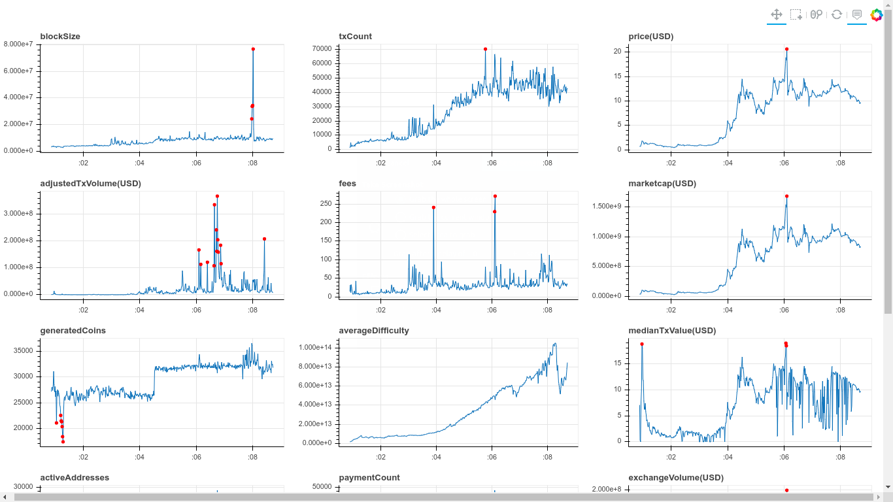

## **Data Scientists come rescue crypto**
>It’s simple, we want things like money transfers or receiving a loan to be as inexpensive as sending a text message. We believe money is of public interest and should then be run by the public. The invention of internet and Bitcoin have sparked a technological and social revolution , that's bringing back power to the everyday citizen.

At Brainrex we collect a lot of data and apply technologies such as anomaly detection, language understanding and computer vision to solve some of the biggest problems slowing down the mass adoption of decentralized technologies. e.g fraud, liquidity, theft, regulation.
Decreasing the barrier of entry of data science in our world is essential, since most blockchain startups lack the funding o
## **Product Features**
### Detect Anomalies in blockchain time series data<br>
<!-- easily embed anomaly detection capabilities into your app -->
We provide anomaly detection capable of identifying common anomalies in blockchain networks and digital asset exchanges. Our AI models detects the data custom



| API Features        | Description  |
| ------------- |:-------------:|
| Real Time Monitoring | Takes streaming data and detects anomalies by using only the most recent data points to determine whether your lastest data point is an anomaly. This method generates a new model using the data stream you send, and determines whether your target data is an anomaly. It gives you the ability to call the API every time you generate a data point, giving you almost real time monitoring capabilities.|
| Detect anomalies in past datasets, in batches | Uses your entire time series as a input, detects data type      |

### Natural Language API<br>

  We provide natural language understanding software capable of indentifying crypto entities, categories, and sentiment as well as reacting to price movements and blockchain network activity.

  | Features        | Description  |
  | ------------- |:-------------:|
  | [Sentiment Analysis](language)    | Understand the overall opinion, feeling, or attitude sentiment expressed in a block of text. |
  | Entity Analysis   | Identify entities within documents — including receipts, invoices, and contracts — and label them by types such as date, person, contact information, organization, location, events, products, and media      |
  | Entity Sentiment  | This endpoint is similar to entity but calculates the sentiment score for each known entity in the sentence, and the importance
  | Document Categorization  | Sort thorugh your documents/text and we will classify it into categories from a pre-defined taxonomy, that includes categories.    |  


## **Data Integrations**

| Features        | Description  |
| ------------- |:-------------:|
| Blockchain Networks   | Understand the overall opinion, feeling, or attitude sentiment expressed in a block of text. |
| Cryptoccurency Markets   | Identify entities within documents — including receipts, invoices, and contracts — and label them by types such as date, person, contact information, organization, location, events, products, and media      |
| Data Warehouses  | This endpoint is similar to entity
 analysis but it analyzes sentiment associated with each entity     |  
| Data Streaming  | Sort thorugh your documents/text and we will classify it into categories, including crypto categories.    |  


## **Cool Features**
### API Explorer<br>
  Brainrex API Explorer allows anyone — be it your development team or your end consumers — to visualize and interact with the API’s resources without having any of the implementation logic in place. It's accesible inside the Admin Console.
  

### Admin Console<br>
  Enhancements that are unique to docsify-themeable—along with docsify- and browser-related bug fixes—provide a more enjoyable and trouble-free experience for site authors and visitors.
  
### Open Source Client libraries<br>
  The proccess of finding and mining data can prove very time consuming, for that reason every time we

## **Pricing**
Units are represented by the following method: Each request is considdered 1 unit regardless of the payload
```
<!-- Language API -->
1 unit = 1 API request with payload of 1000 unicode characters.
<!-- Anomaly Detection API  -->
1 unit = 1 API request with payload of 1000 timestamps- value  pairs.
```


| Anomaly API        | Language API           | Price  |
| ------------- |:-------------:| -----:|
| 10k units      | 5k units | $39 |
| 250k units     | 100k units      |   $200 |
| 5M units | 1 M units      |    $800 |

## **What's Next?**

  - **[Install Client Libraries](quick-start)**

  - **Build your first App<br>**

    - **[Build your first App](quickstart#first-app)**


## Ask us questions
- Join telegram group [Telegram](https://t.me/brainrex) .
- Follow [@BrainrexxAI](https://twitter.com/brainrexAI) for announcements
- Add a ⭐️ [star on GitHub](https://github.com/brainrexAPI)
